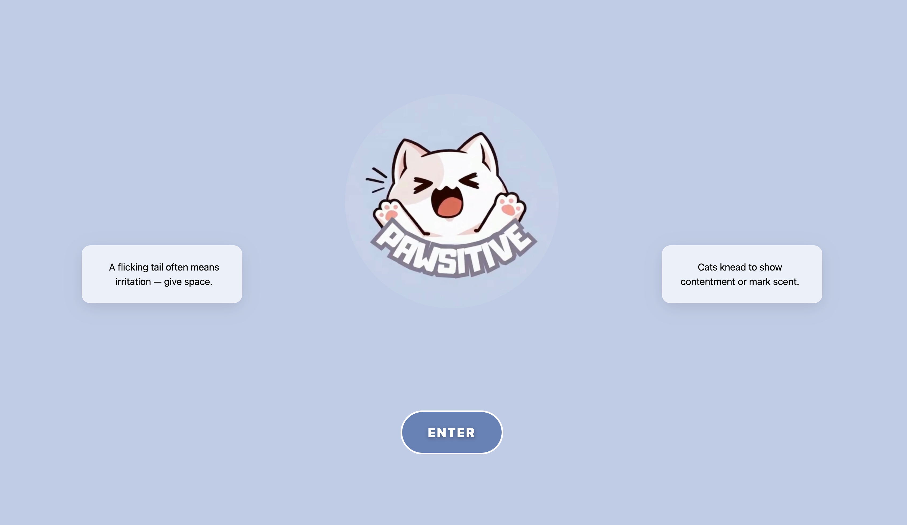
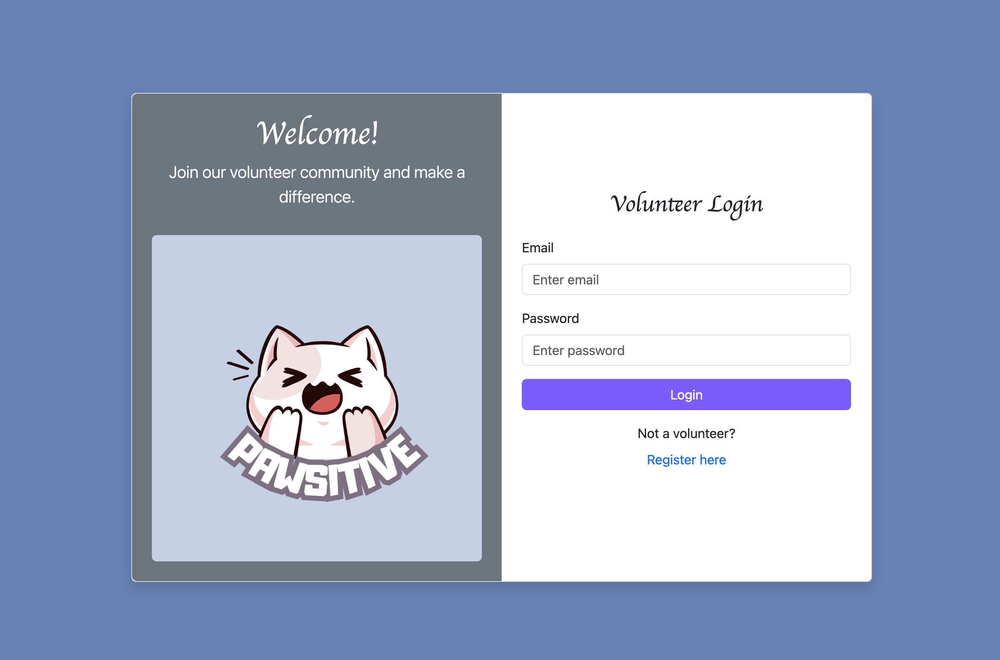
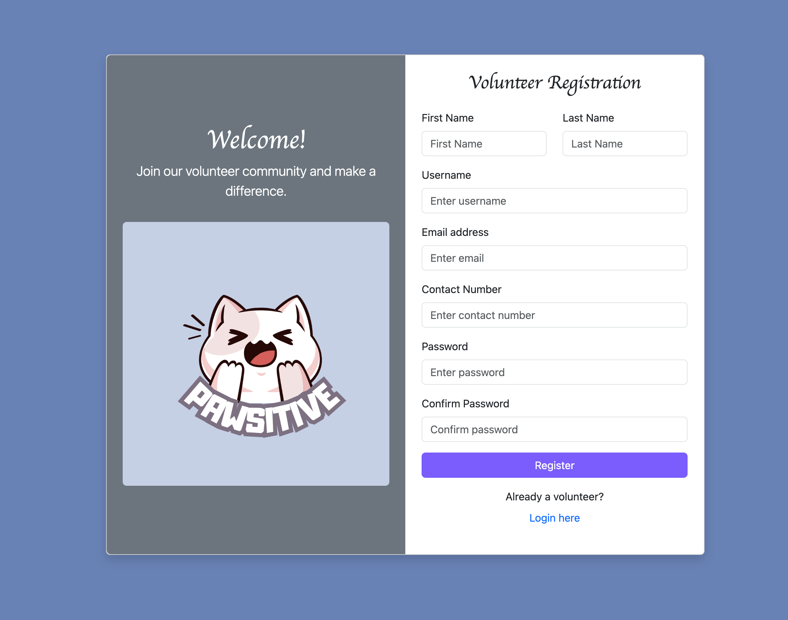
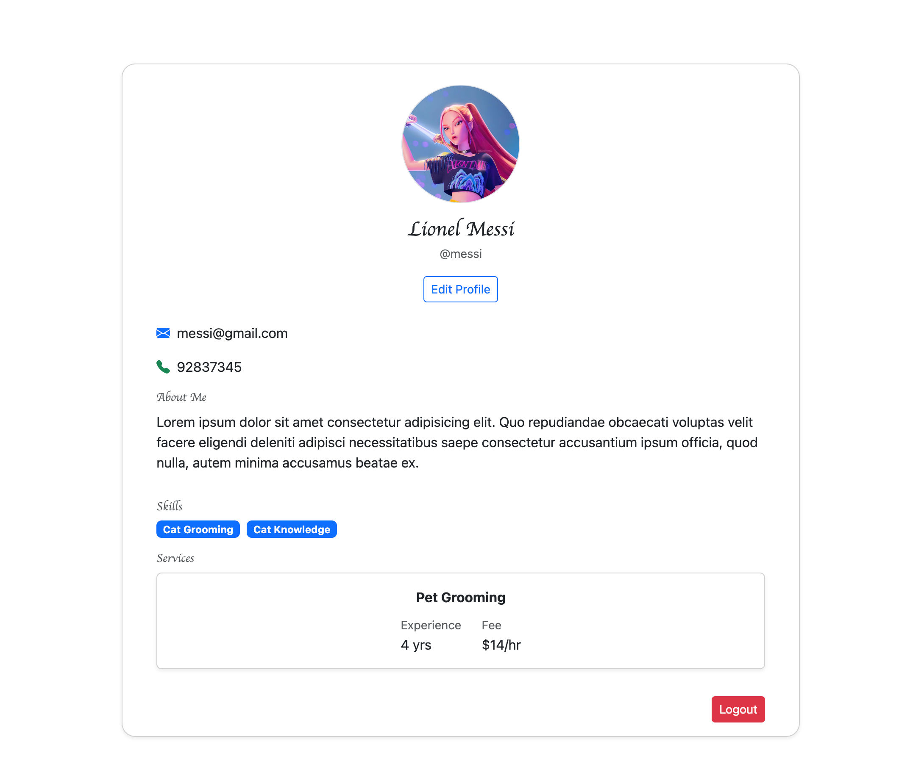
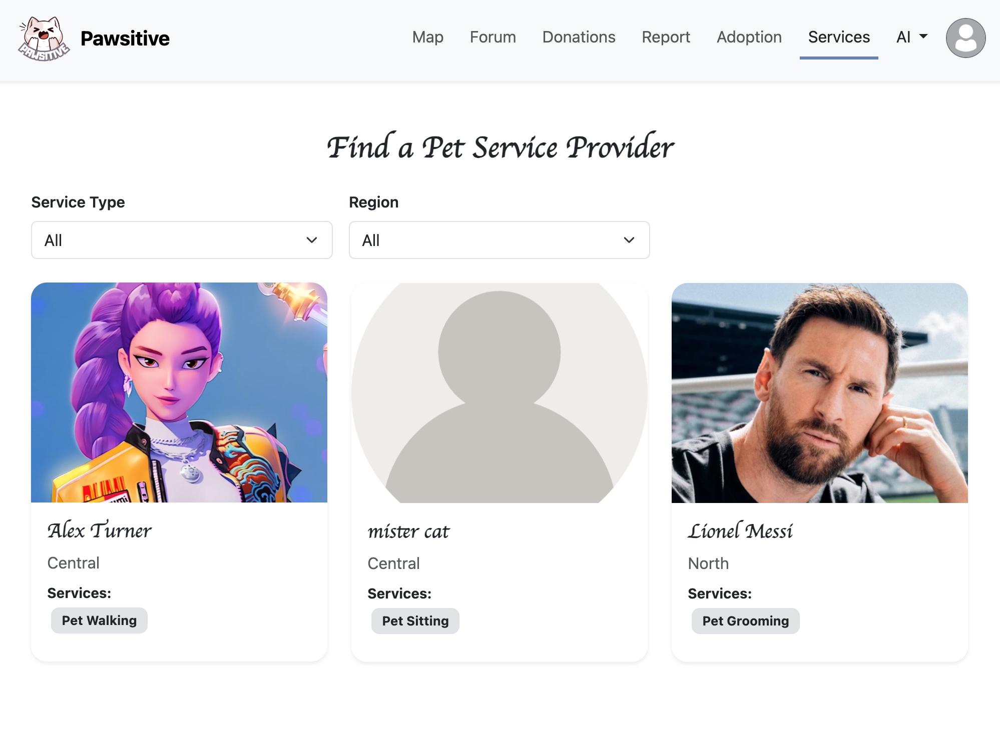
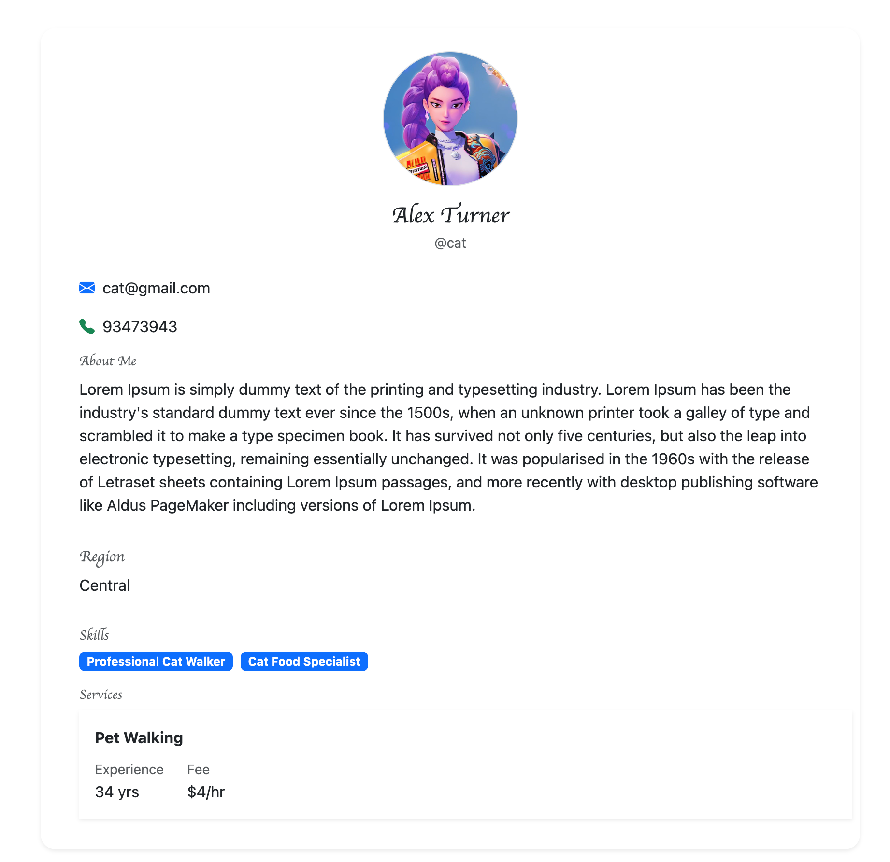

# 🏫 IS216 Web Application Development II

---

## Section & Group Number
G3 Group 5

---

## Group Members

 Photo | Full Name | Role / Features Responsible For |
|:--:|:--|:--|
|  | Muhammad Ashraf Bin Mustafa | Project Lead, CSS/JS Animation Specialist, Donation Feature |   
|  | Rosh Chan | UI/UX, HTML Developer, Adoption (Listing + Form) Feature |
|  | Charmaine Lim Min Xuan | Content Creator, CSS Developer, Forum Feature |
|  | Tan Xue Wen, Rayner | JavaScript Developer, QA Tester, Map/Cat Tracking Feature |
|  | Chan Jing Xiang | Database & Auth, Volunteer Profile  & Services Feature |
|  | Soon Shi Heng, Kevan | Frontend Lead (HTML, CSS, JS), AI + Guide Feature |
<!-- > Place all headshot thumbnails in the `/photos` folder (JPEG or PNG). -->
---

## Business Problem

Community cat welfare in Singapore relies heavily on the goodwill of our residents. Still, current practices do not utilise technology much: handwritten notes in void decks, informal WhatsApp, etc. These efforts, while sincere, often lack structure and continuity. For example, one group of residents may update each other via WhatsApp about feeding times, but the information rarely extends beyond the chat. Similarly, spotters of injured cats may post a picture online, but without a centralised log, the follow-up care depends on chance visibility.
There is no consistent system for logging on feeding schedules or medical emergencies, no transparent way to coordinate among multiple volunteers, and no simple platform to sustain community engagement beyond the few who already commit time and money. Also, opportunities for broader participation like crowdfunding are scattered, inaccessible to the wider public who may wish to contribute.
Our project addresses these issues by providing a unified Community Cat Welfare Tracker that empowers volunteers and our communities to help these felines. In doing so, it transforms fragmented, low-tech practices into a sustainable, transparent, and community-driven system of shared responsibility for Singapore’s beloved community cats.
<!-- 
> *Example:*  
> Small local businesses struggle to maintain an online presence, limiting visibility to customers.  
> Our web application helps them list menus, accept feedback, and attract more customers. -->

---

## Web Solution Overview

### 🎯 Intended Users
- Community Cat Volunteers
- Cat Lovers
- Prospective Cat Adopters


### 💡 What Users Can Do & Benefits
Explain the core features and the benefit each provides.  

| Feature | Description | User Benefit |
|:--|:--|:--|
| Volunteer Signup & Login | Signup/login| Secure access for volunteers to submit cat profiles |
| Map Page | Identify cat profiles on a map | Easily locate cats and their details in a specific area |
| Cat Profile | Contains personal information (name, breed, etc) | Users can view detailed information about each cat |
| Volunteer Profile | Contains volunteer information and services | Users can view detailed information about the volunteer and the services they may provide |
| Cat Profile Submission | Only available for volunteers | Enables volunteers to contribute cat data safely |
| Forum Page | View list of discussions | Central hub for community engagement and information sharing |
| News/Report Feed | Reports on missing, found, or RIP cats | Keep community informed of important events |
| AI Camera Cat Identification | Identify cat breed via camera | Helps users recognize and learn about different breeds |
| Cat Breed Guidebook | Provide information on cat breeds | Educates users and promotes breed awareness |
| Services | Provide Service Offerings from volunteers | Allow users to engage the services of volunteers e.g. pet sitting |
| Adoption Page | List cat profile summaries on map | Helps potential adopters easily find cats for adoption |
| Donation Page | Stripe popup/aside for donations | Simplifies contribution process for supporting cats |

---

## Tech Stack

| Logo | Technology | Purpose / Usage |
|:--:|:--|:--|
|  | **HTML5** | Structure and content |
|  | **CSS3 / Bootstrap** | Styling and responsiveness |
|  | **JavaScript (ES6)** | Client-side logic and interactivity |
|  | **Vite** | Development server and build tool |
|  | **Vue.js 3** | Component-based frontend framework |
|  | **Firebase** | Authentication and Firestore database services |
|  | **Node.JS + Express.JS** | For Stripe Server Only|

<!-- > Add or remove technologies depending on your project stack (e.g., Express.js, Supabase, MongoDB Atlas, AWS S3). -->

---

## Use Case & User Journey

Provide screenshots and captions showing how users interact with your app.

1. **Landing Page**  
     
   - Displays the landing page, an entry point for all users

2. **Login/Register**  
     
     
   - Register as an volunteer to access the features

3. **My Profile Page**  
     
   - Shows the logged in user's profile
   - Ability to edit profile (e.g change contact, add services etc)

4. **Services Page**  
     
   - Displays the list of volunteers who have services offered
   - Ability to filter by region and type of service
   - Clicking on it will go to the volunteer profile page

5. **Volunteer Page**  
  
   - Displays the public profile of a volunteer
   

<!-- > Save screenshots inside `/screenshots` with clear filenames. -->

---

## Developers Setup Guide

Comprehensive steps to help other developers or evaluators run and test your project.

---

### 0) Prerequisites
- [Git](https://git-scm.com/) v2.4+  
- [Node.js](https://nodejs.org/) v18+ and npm v9+  
- [Vue.js](https://nodejs.org/) v18+ and npm v9+  
<!-- - Access to backend or cloud services used (Firebase, MongoDB Atlas, AWS S3, etc.) -->

---

### 1) Download and run the Vue Project
```bash
git clone https://github.com/ashmewz/is216-project.git
cd Pawsitive
npm install
```

### 2) Run the Frontend
To start the development server:
```bash
npm run dev
```
The project will run on [http://localhost:5173](http://localhost:5173) by default.

<!-- To build and preview the production version:
```bash
npm run build
npm run preview
``` -->


### 2) Running Stripe server
This project uses a 2nd server (backend) to run the Stripe embedding. We have to run a server using Node.

All these needs to be run in the Pawsitive directory (so make sure you are in that folder, else cd to `Pawsitive/` directory)
1. Check if Node & npm are installed on your machine. `node -v` and `npm -v` separately
2. Node modules are required locally too. Run `npm install`
3. In Pawsitive directory, run `node server/server.js` which will run in port 4242 
4. Open another powershell/terminal using '+' and run `npm run dev` to run the frontend site in port 5173

In the donations page, select the donation amount, then "Continue".
Your 2nd server would have a log something like: `💰 Received donation amount: 12`

Testing card numbers can be found from this stripe documentation: `https://docs.stripe.com/testing`
Card number: 4242 4242 4242 4242
Card expiry: 12/34
Card CVC: 567

Upon "Donate Now" success, you will currently be directed to a blank page, with the following browser path pattern:
`http://localhost:5173/donate/success?payment_intent=pi_3SI1WnA4UE4DKmEO0KHD04IZ&payment_intent_client_secret=pi_3SI1WnA4UE4DKmEO0KHD04IZ_secret_g26E0UQS8m7bJ1aUh70EQcleP&redirect_status=succeeded`
In future this should redirect back to some other page. But this has yet to be implemented. (CAA 14 Oct 2025)


## Testing AI Recognition Page
You must have a VITE_GEMINI_API_KEY value in your .env file.
ENV files are git ignored. Please get the gemini API key from Kevan.
The key allows for up to 50 per day and resets.

To test:
1. Load the page.
2. Grab a random cat image from google and upload it.
3. Click "Run cat prediction".
You will see a prediction of what cat breed the image is with a probability/confidence percentage.
And then afterwards you will also see the generated care tips from Gemini API.

---

<!-- ### 2) Configure Environment Variables
Create a `.env` file in the root directory with the following structure:

```bash
VITE_API_URL=<your_backend_or_firebase_url>
VITE_FIREBASE_API_KEY=<your_firebase_api_key>
VITE_FIREBASE_AUTH_DOMAIN=<your_auth_domain>
VITE_FIREBASE_PROJECT_ID=<your_project_id>
VITE_FIREBASE_STORAGE_BUCKET=<your_storage_bucket>
VITE_FIREBASE_MESSAGING_SENDER_ID=<your_sender_id>
VITE_FIREBASE_APP_ID=<your_app_id>
```

> Never commit the `.env` file to your repository.  
> Instead, include a `.env.example` file with placeholder values.

---

### 3) Backend / Cloud Service Setup

#### Firebase
1. Go to [Firebase Console](https://console.firebase.google.com/)
2. Create a new project.
3. Enable the following:
   - **Authentication** → Email/Password sign-in
   - **Firestore Database** or **Realtime Database**
   - **Hosting (optional)** if you plan to deploy your web app
4. Copy the Firebase configuration into your `.env` file.

#### Optional: Express.js / MongoDB
If your app includes a backend:
1. Create a `/server` folder for backend code.
2. Inside `/server`, create a `.env` file with:
   ```bash
   MONGO_URI=<your_mongodb_connection_string>
   JWT_SECRET=<your_jwt_secret_key>
   ```
3. Start the backend:
   ```bash
   cd server
   npm install
   npm start
   ```

---

### 4) Run the Frontend
To start the development server:
```bash
npm run dev
```
The project will run on [http://localhost:5173](http://localhost:5173) by default.

To build and preview the production version:
```bash
npm run build
npm run preview
```

---

### 5) Testing the Application

#### Manual Testing
Perform the following checks before submission:

| Area | Test Description | Expected Outcome |
|:--|:--|:--|
| Authentication | Register, Login, Logout | User successfully signs in/out |
| CRUD Operations | Add, Edit, Delete data | Database updates correctly |
| Responsiveness | Test on mobile & desktop | Layout adjusts without distortion |
| Navigation | All menu links functional | Pages route correctly |
| Error Handling | Invalid inputs or missing data | User-friendly error messages displayed |

#### Automated Testing (Optional)
If applicable:
```bash
npm run test
```

---

### 6) Common Issues & Fixes

| Issue | Cause | Fix |
|:--|:--|:--|
| `Module not found` | Missing dependencies | Run `npm install` again |
| `Firebase: permission-denied` | Firestore security rules not set | Check rules under Firestore → Rules |
| `CORS policy error` | Backend not allowing requests | Enable your domain in CORS settings |
| `.env` variables undefined | Missing `VITE_` prefix | Rename variables to start with `VITE_` |
| `npm run dev` fails | Node version mismatch | Check Node version (`node -v` ≥ 18) |

---

## Group Reflection

Each member should contribute 2–3 sentences on their learning and project experience.

> **Example Template:**  
> - *Alice:* Learned to build reusable Vue components and manage state effectively.  
> - *Ben:* Gained experience connecting frontend and backend APIs.  
> - *Chloe:* Improved UI/UX design workflow and collaboration using Figma.  
> - *David:* Understood how Firebase Authentication and Firestore integrate with modern SPAs.  

As a team, reflect on:
- Key takeaways from working with real-world frameworks  
- Challenges faced and how they were resolved  
- Insights on teamwork, project management, and problem-solving   -->
