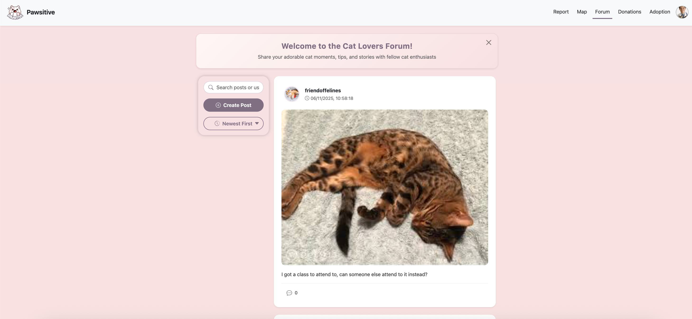

# 🏫 IS216 Web Application Development II

---

## Section & Group Number
G3 Group 5

---

## Group Members

 Photo | Full Name | Role / Features Responsible For |
|:--:|:--|:--|
|  | Muhammad Ashraf Bin Mustafa | Project Lead, CSS/JS Animation, Donation Page |   
|  | Rosh Chan | UI/UX,  Adoption (Listing + Form) Page |
|  | Charmaine Lim Min Xuan |  Forum Page, Report Page|
|  | Tan Xue Wen, Rayner |Map/Cat Tracking Page, Cat Profile Page |
|  | Chan Jing Xiang | Database &Auth, Login & Register, Volunteer Profile Page  |
|  | Soon Shi Heng, Kevan | Report Page AI & Map features |
<!-- > Place all headshot thumbnails in the `/photos` folder (JPEG or PNG). -->
---

## Business Problem

In Singapore, reporting and locating lost or injured cats remains as a fragmented and inconvenient process. Residents often have to rely on different channels such as Facebook, WhatsApp groups or notices around their neighbourhood. This makes it difficult for others to locate the right information quicky and provide timely help. Without a centralised reporting system, many injured or missing cats go unnoticed, and coordination between volunteers and the public are inefficient. These disconnected efforts not only delays aid for cats in need but also make it hard for the community to stay informed.

Our project addresses this issue by introducing a unified, easy-to-use platform where users can conveniently report lost or injured cats, track their profiles through our map feature, and communitcate with others more effectively. In addition, the donation and adoption page encourages community participation and support, turning cat welfare efforts into a more connected and sustainable ecosystem.
<!-- 
> *Example:*  
> Small local businesses struggle to maintain an online presence, limiting visibility to customers.  
> Our web application helps them list menus, accept feedback, and attract more customers. -->

---

## Web Solution Overview

[Deployed App Link](https://pawsitive-sg.vercel.app/)
### 🎯 Intended Users
- Community Cat Volunteers
- Cat Lovers


### 💡 What Users Can Do & Benefits
Explain the core features and the benefit each provides.  

| Feature | Description | User Benefit |
|:--|:--|:--|
| Volunteer Signup & Login | Signup/login| Secure access for volunteers to submit cat profiles |
| Report Lost/Injured Cats | Report a lost/injured cat | Users can report a missing/injured cat, before they submit, it will check if there is any similar reports reported in the location in the past 24 hours|
| Map Page | Identify reported lost/injured cats | Easily locate reported lost/injured cats and their details in a specific area |
| Cat Profile | Contains cat information (name, breed, etc) | Users can view detailed information about each cat, and also the status |
| Volunteer Profile | Contains volunteer information and services | Users can view detailed information about the volunteer and the services they may provide |
| Forum Page | View list of discussions | Central hub for community engagement and information sharing |
| Adoption Page | List cat profile summaries on map | Helps potential adopters easily find cats for adoption |
| Donation Page | Stripe popup/aside for donations | Simplifies contribution process for supporting cats |
---

## Tech Stack

| Logo | Technology | Purpose / Usage |
|:--:|:--|:--|
|  | **HTML5** | Structure and content |
|  | **CSS3 / Bootstrap** | Styling and responsiveness |
|  | **JavaScript (ES6)** | Client-side logic and interactivity |
|  | **Vite** | Development server and build tool |
|  | **Vue.js 3** | Component-based frontend framework |
|  | **Firebase** | Authentication and Firestore database services |
|  | **Node.JS + Express.JS** | For Stripe (Only works in vercel)|

<!-- > Add or remove technologies depending on your project stack (e.g., Express.js, Supabase, MongoDB Atlas, AWS S3). -->

---

## Use Case & User Journey

Provide screenshots and captions showing how users interact with your app.

1. **Landing Page**  
     
   - Features: Displays the landing page, an entry point for all users

2. **Login/Register**  
     
     
   - User Jouney: I am on my way to school, and i spot an injured cat, i want to report it to Pawsitive, so first i login

   - Features: Register/login

3. **Report**  
     
   - User Jouney: Upon login, I am directed straight to the report page, i upload the image of the cat and it will analyzes the cat breed, then it auto checks whether there are similar reports (same breed, within 2km) reported in the past 24hr. There is no similar reports, so i proceed to submit my report.

   - Features: Submit missing/injured cat report. Form auto detects similar reports (same breed, within 2km) reported in the past 24hrs

4. **Map and Cat Profile**  
     
     
   - User Jouney: I can go to the map page identify reported cats's last location, and i can hover over the pins and click on the full profile to get a detailed view of the cats.

   - Features: View the reported cats on a map view


4. **Forum Page**  
     

   - User Journey: After submitting the report, I go to forum and create a new post about my new report, to call attention from other volunteers to take note. I also notice a post about a vet offering their services, so i can comment on his post to notify them about my report, or I can click to his profile and contact him directly via his email or phone.

   - Features: Create a new post, comment on a post


5. **Donation Page**  
   
   - User Journey: I am also feeling very generous today, and I feel like donating to the cats community, so i go ahead to make a donation on the page

   - Features: Make a donation to the welfare community using their credit card

5. **Adoption Page**  
   
   - User Journey: I am also feeling extra generous today, and I feel like adopting a cat, so I looked through the adoption listing and submit an interest form.

   - Features: View adoption cats listing, submit interest form
   
6. **My Profile Page**  
     
   - Edit profile (e.g change contact, add services etc)


7. **Volunteer Page**  
     
   - Displays the public profile of a user
  


<!-- > Save screenshots inside `/screenshots` with clear filenames. -->

---

## Developers Setup Guide

Comprehensive steps to help other developers or evaluators run and test your project.

---

### 0) Prerequisites
- [Git](https://git-scm.com/) v2.4+  
- [Vue.js](https://nodejs.org/) v18+ and npm v9+  
- [Firebase](https://console.firebase.google.com) 

---

### 1) Download and run the Vue Project
```bash
git clone https://github.com/ashmewz/is216-project.git
cd Pawsitive
npm install
```

### 2) Run the Frontend
To start the development server:
```bash
npm run dev
```
The project will run on [http://localhost:5173](http://localhost:5173) by default.


### 3) Testing the Stripe feature
This project uses a 2nd server (backend) to run the Stripe embedding. We have to run a server using Node. Through Vercel, its backend server will automatically be run. 

Testing card numbers can be found from this stripe documentation: 

https://docs.stripe.com/testing

Card number: 4242 4242 4242 4242

Card expiry: 12/34

Card CVC: 567

Wrong card info input will be detected by Stripe. Upon donation success, you will currently be directed to a success page.

<!-- ### 2) Configure Environment Variables
Create a `.env` file in the root directory with the following structure:

```bash
VITE_API_URL=<your_backend_or_firebase_url>
VITE_FIREBASE_API_KEY=<your_firebase_api_key>
VITE_FIREBASE_AUTH_DOMAIN=<your_auth_domain>
VITE_FIREBASE_PROJECT_ID=<your_project_id>
VITE_FIREBASE_STORAGE_BUCKET=<your_storage_bucket>
VITE_FIREBASE_MESSAGING_SENDER_ID=<your_sender_id>
VITE_FIREBASE_APP_ID=<your_app_id>
```

> Never commit the `.env` file to your repository.  
> Instead, include a `.env.example` file with placeholder values. -->

---

### 4) Backend / Cloud Service Setup

#### Firebase
1. Go to [Firebase Console](https://console.firebase.google.com/)
2. Create a new project.
3. Enable the following:
   - **Authentication** → Email/Password sign-in
   - **Firestore Database** 
4. Create a new web app in project settings
5. Copy the Firebase configuration into the firebase.js file

---


### 5) Testing the Application

#### Manual Testing
Perform the following checks before submission:

| Area | Test Description | Expected Outcome |
|:--|:--|:--|
| Authentication | Register, Login, Logout | User successfully signs in/out |
| CRUD Operations | Add, Edit, Delete data | Database updates correctly |
| Responsiveness | Test on mobile & desktop | Layout adjusts without distortion |
| Navigation | All menu links functional | Pages route correctly |
| Error Handling | Invalid inputs or missing data | User-friendly error messages displayed |

#### Automated Testing (Optional)
If applicable:
```bash
npm run test
```

<!-- 
### 6) Common Issues & Fixes

| Issue | Cause | Fix |
|:--|:--|:--|
| `Module not found` | Missing dependencies | Run `npm install` again |
| `Firebase: permission-denied` | Firestore security rules not set | Check rules under Firestore → Rules |
| `CORS policy error` | Backend not allowing requests | Enable your domain in CORS settings |
| `.env` variables undefined | Missing `VITE_` prefix | Rename variables to start with `VITE_` |
| `npm run dev` fails | Node version mismatch | Check Node version (`node -v` ≥ 18) | -->


---

## Group Reflection


 - *Ashraf:* Learned to build reusable Vue components and manage state effectively.  

 - *Rosh:* Gained experience connecting frontend and backend APIs.  

 - *Charmaine:* Improved UI/UX design workflow and collaboration using Figma.  

 - *Rayner:* I learnt how to guide people who are new to web development, and adjust tasks appropriate to their current learnings. Learnt to better break down tasks into more followable steps that help faccilitate learning.

 - *Kevan:* Understood how Firebase Authentication and Firestore integrate with modern SPAs.  

 - *Jing Xiang:* I learnt how to use github collaboratively, branching, pull requests etc. And the general usage of vue.js and firebase

