# 🏫 IS216 Web Application Development II

---

## Section & Group Number
G3 Group 5
DEPLOYED LINK: [https://pawsitive-sg.vercel.app](https://pawsitive-sg.vercel.app)

---

## Group Members

 Photo | Full Name | Role / Features Responsible For |
|:--:|:--|:--|
|  | Muhammad Ashraf Bin Mustafa | Project Lead, CSS/JS Animation, Donation Page UI &  Backend |   
|  | Rosh Chan Teck Woon | UI/UX,  Adoption Page UI & Firebase Integration |
|  | Tan Xue Wen, Rayner |Map Page UI & Firebase Integration, Cat Profile Page UI & Firebase Integration |
|  | Charmaine Lim Min Xuan | UI/UX, Forum Page UI, Report Page UI, Cat Profile Page UI|
|  | Chan Jing Xiang |Landing Page UI, LoginRegister Page UI & Firebase Integration ,Volunteer Profile Page UI & Firebase Integration  |
|  | Soon Shi Heng, Kevan | Report Page AI, Backend & Firebase Integration, Forum Page Firebase Integration   |
<!-- > Place all headshot thumbnails in the `/photos` folder (JPEG or PNG). -->
---

## Business Problem

In Singapore, reporting and locating lost or injured cats remains a fragmented and inconvenient process. Residents often have to rely on different channels such as Facebook, WhatsApp groups or notices around their neighbourhood. This makes it difficult for others to locate the right information quicky and provide timely help. Without a centralised reporting system, many injured or missing cats go unnoticed, and coordination between volunteers and the public are inefficient. These disconnected efforts not only delays aid for cats in need but also make it hard for the community to stay informed.

Our project addresses this issue by introducing a unified, easy-to-use platform where users can conveniently report lost or injured cats, track their profiles through our map feature, and communicate with others more effectively. In addition, the donation and adoption page encourages community participation and support, turning cat welfare efforts into a more connected and sustainable ecosystem.
<!-- 
> *Example:*  
> Small local businesses struggle to maintain an online presence, limiting visibility to customers.  
> Our web application helps them list menus, accept feedback, and attract more customers. -->

---

## Web Solution Overview

[Deployed App Link](https://pawsitive-sg.vercel.app/)
### 🎯 Intended Users
- Community Cat Volunteers
- Cat Lovers


### 💡 What Users Can Do & Benefits
Explain the core features and the benefit each provides.  

| Feature | Description | User Benefit |
|:--|:--|:--|
| Volunteer Signup & Login | Signup/login| Secure access for volunteers |
| Report Lost/Injured Cats | Report a lost/injured cat | Users can report a missing/injured cat, before they submit, an automatic check of similar reports reported in the location in the past 24 hours will be performed|
| Map Page | Identify reported lost/injured cats | Easily locate reported lost/injured cats and their details in a specific area |
| Cat Profile | Contains cat information (name, breed, etc) | Users can view detailed information about each reported cat|
| Volunteer Profile | Contains volunteer information and services | Users can view detailed information about the volunteer and the services and skills they may provide |
| My Profile | Edit my own profile | Users can edit their own profile infomation, add new skills/services |
| Forum Page | View list of discussions | Central hub for community engagement and information sharing, follow up for cat reports |
| Adoption Page | List cat profile summaries on map | Helps potential adopters easily find cats for adoption |
| Donation Page | Stripe popup for donations | Simplifies contribution process for supporting cats |

---

## Tech Stack

| Logo | Technology | Purpose / Usage |
|:--:|:--|:--|
|  | **HTML5** | Structure and content |
|  | **CSS3 / Bootstrap** | Styling and responsiveness |
|  | **JavaScript (ES6)** | Client-side logic and interactivity |
|  | **Vite** | Development server and build tool |
|  | **Vue.js 3** | Component-based frontend framework |
|  | **Firebase** | Authentication and Firestore database services |
|  | **Node.JS + Express.JS** | For Stripe (Only works in vercel)|

<!-- > Add or remove technologies depending on your project stack (e.g., Express.js, Supabase, MongoDB Atlas, AWS S3). -->

---

## Use Case & User Journey

<!-- Provide screenshots and captions showing how users interact with your app. -->

1. **Landing Page**  
   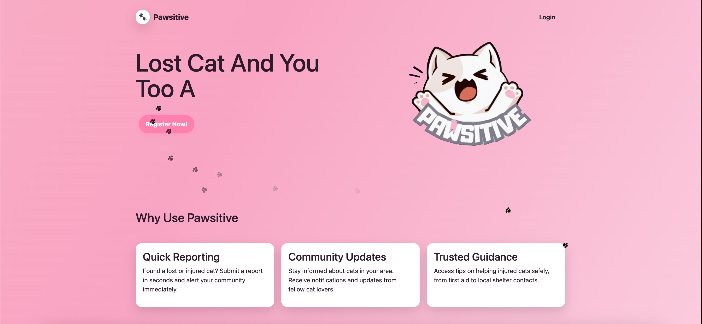  
   - Features: Displays the landing page, an entry point for all users

2. **Login/Register**  
   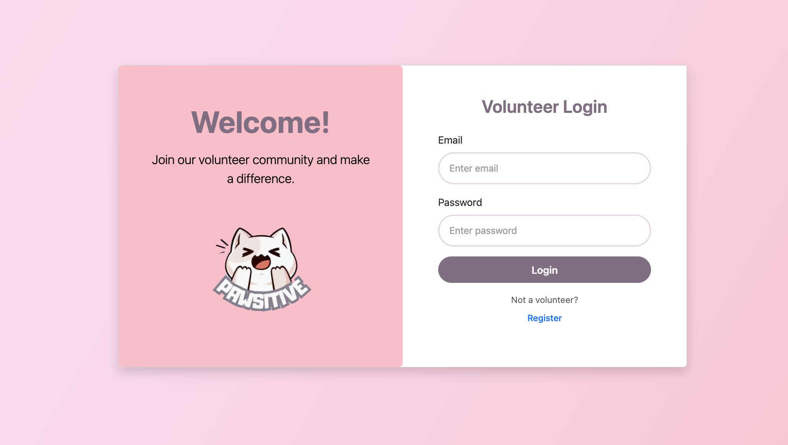  
   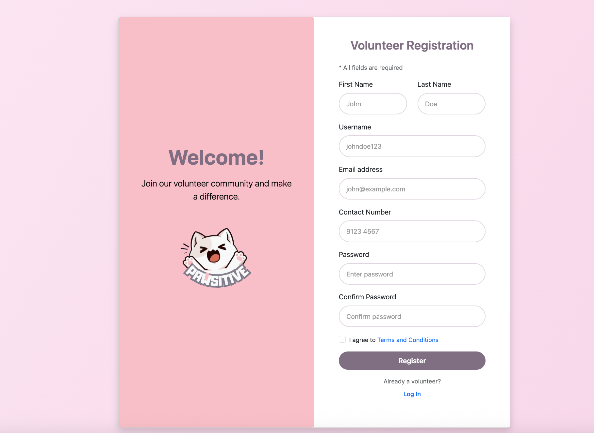  
   - User Journey: While walking to school, I notice an injured cat and decide to report it through Pawsitive. I opened the website and log in to my account.

   - Features: Register/login

3. **Report**  
   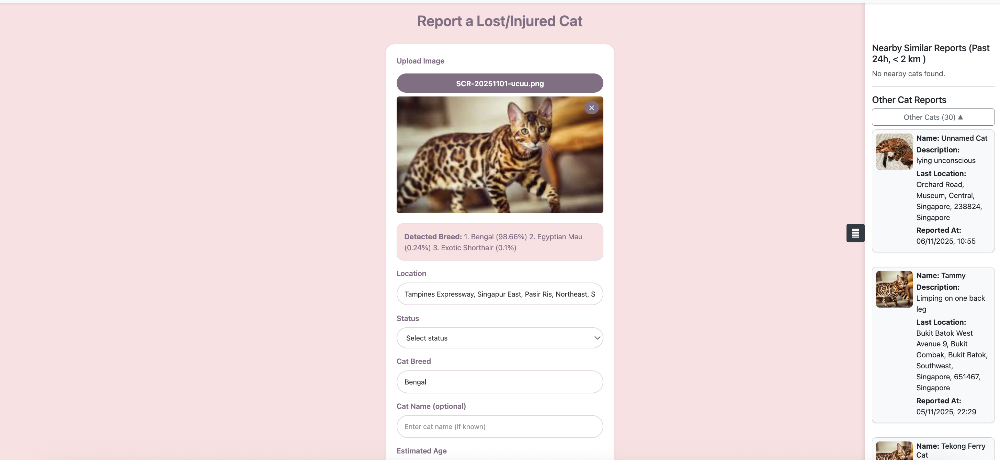  
    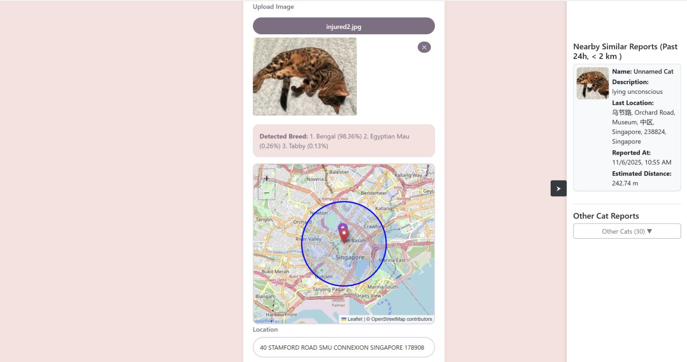  
   - User Journey: After logging in, I am directed straight to the report page. I upload a photo of the injured cat and see that the system analysing its breed. It also automatically checks for similar reports (same breed, within 2km that was reported in the past 24 hours). However, for my area, there is no similar reports, so I proceed to submit my report.

   - Features: Submit missing/injured cat report. Form auto detects similar reports (same breed, within 2km) reported in the past 24hrs

   - Note: second image shown is when similar report is detected


4. **Map and Cat Profile**  
   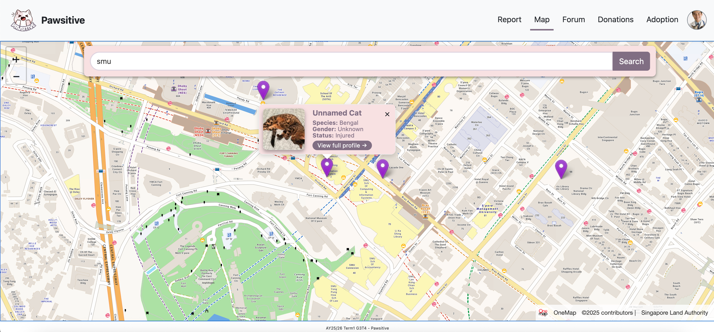  
   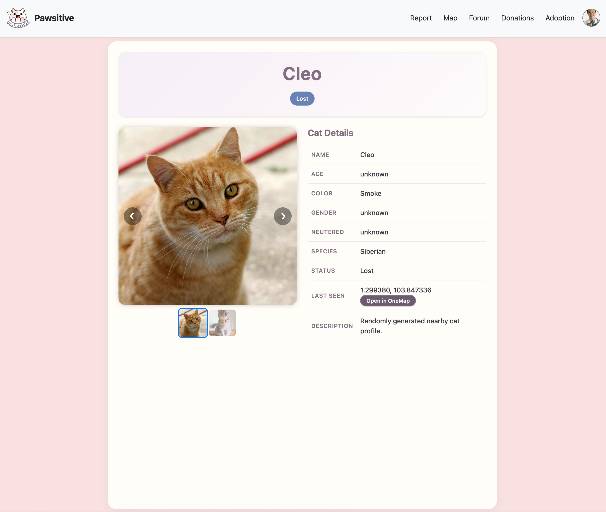  
   - User Journey: I navigate to the map page to view the locations of reported cats. By hovering over the pins and clicking on them, I can access detailed information of each cat.

   - Features: View the reported cats on a map view


5. **Forum Page**  
   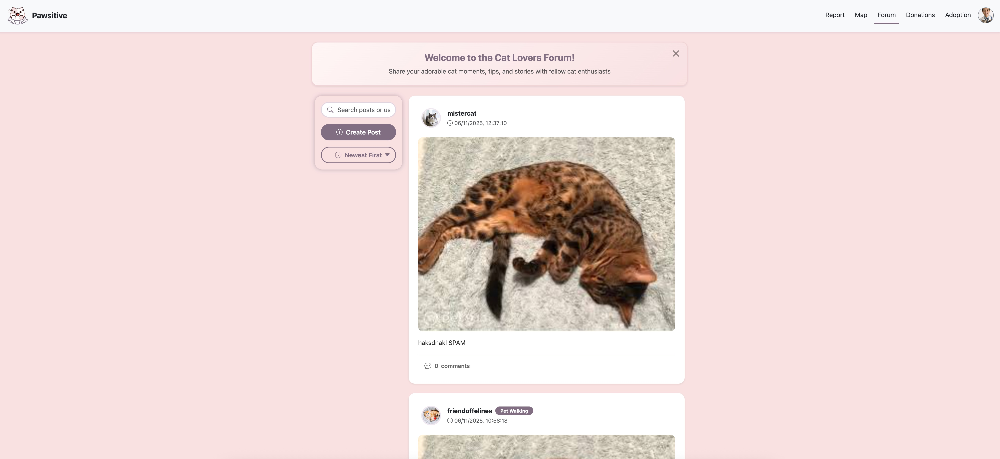  

   - User Journey: After submitting the report and viewing the cat profiles, I click on "Forum" to create a post about the injured cat that I spotted on the way to school. As I am rushing for my class, I wanted to let the community know so that someone else can attend to it instead. Upon uploading my post, I scrolled through the posts and noticed a post from a vet that was offering their services. I could either comment on the post to reach out to them about the injured cat or contact the vet directly through the contact methods listed on their profile page.

   - Features: Create a new post, comment on a post


6. **Donation Page**  
   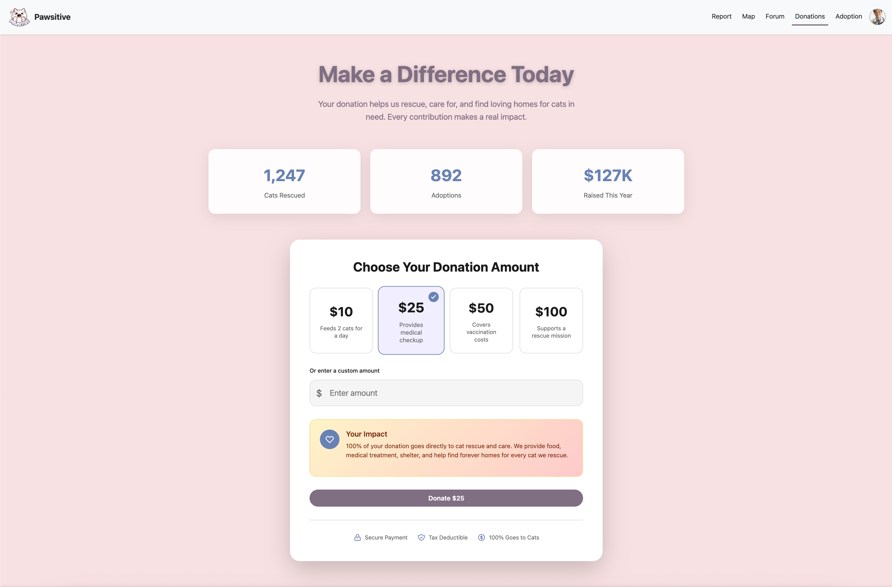
   - User Journey: I come across Pawsitive and decide to contribute to the cat community. I visit the "Donations" page and make a donation to support local shelters and rescue efforts, believing that every contribution can make a meaningful difference.

   - Features: Make a donation to the welfare community using their credit card

7. **Adoption Page**  
   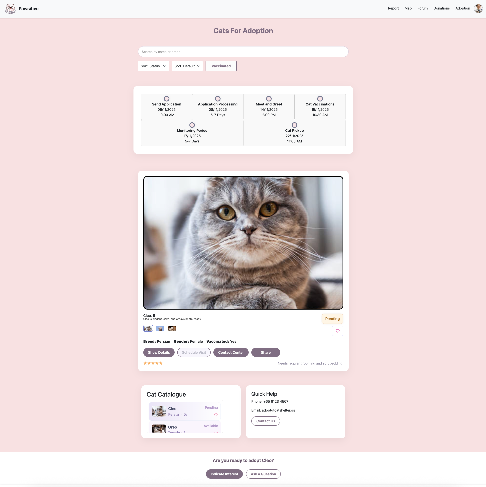
   - User Journey: After donating, I feel inspired to do even more for the community. I visit the “Adoption” page and browse through the listings. One cat catches my attention, and I excitedly submit an interest form, hoping to give it a loving home.

   - Features: View adoption cats listing, submit interest form
   
8. **My Profile Page**  
   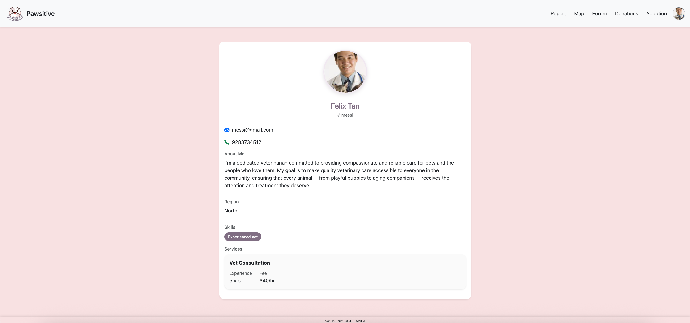  
   - Edit profile (e.g change contact, add services etc)


9. **Volunteer Page**  
   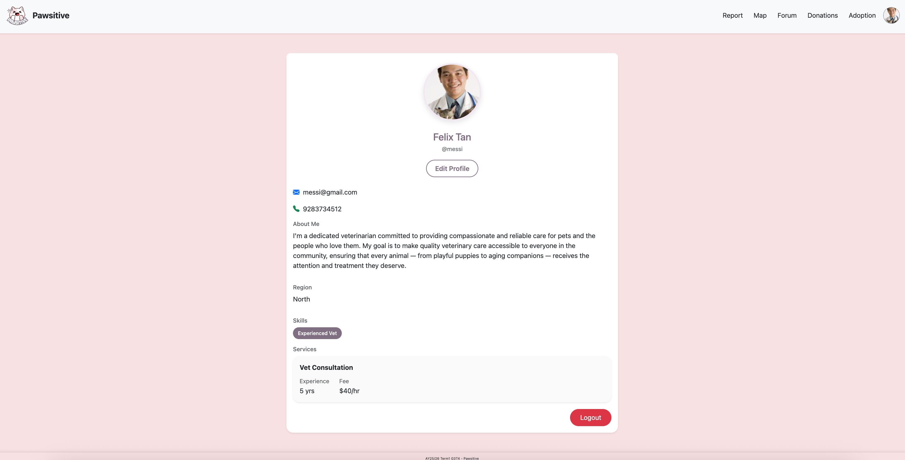  
   - Displays the public profile of a user
  


<!-- > Save screenshots inside `/screenshots` with clear filenames. -->

---

## Developers Setup Guide

Comprehensive steps to help other developers or evaluators run and test your project.

---

### 0) Prerequisites
- [Git](https://git-scm.com/) v2.4+  
- [Vue.js](https://nodejs.org/) v18+ and npm v9+  
- [Firebase](https://console.firebase.google.com) 

---

### 1) Download and run the Vue Project
```bash
git clone https://github.com/ashmewz/is216-project.git
cd Pawsitive
npm install
```

### 2) Run the Frontend
To start the development server:
```bash
npm run dev
```
The project will run on [http://localhost:5173](http://localhost:5173) by default.


### 2) Running Stripe server
This project uses a 2nd server (backend) to run the Stripe embedding. We have to run a server using Node. Through Vercel, its backend server will automatically be run. 

Testing card numbers can be found from this stripe documentation: 

https://docs.stripe.com/testing

Card number: 4242 4242 4242 4242

Card expiry: 12/34

Card CVC: 567

Wrong card info input will be detected by Stripe. Upon donation success, you will currently be directed to a success page.

<!-- ### 2) Configure Environment Variables
Create a `.env` file in the root directory with the following structure:

```bash
VITE_API_URL=<your_backend_or_firebase_url>
VITE_FIREBASE_API_KEY=<your_firebase_api_key>
VITE_FIREBASE_AUTH_DOMAIN=<your_auth_domain>
VITE_FIREBASE_PROJECT_ID=<your_project_id>
VITE_FIREBASE_STORAGE_BUCKET=<your_storage_bucket>
VITE_FIREBASE_MESSAGING_SENDER_ID=<your_sender_id>
VITE_FIREBASE_APP_ID=<your_app_id>
```

> Never commit the `.env` file to your repository.  
> Instead, include a `.env.example` file with placeholder values. -->

---

### 4) Backend / Cloud Service Setup

#### Firebase
1. Go to [Firebase Console](https://console.firebase.google.com/)
2. Create a new project.
3. Enable the following:
   - **Authentication** → Email/Password sign-in
   - **Firestore Database** 
4. Create a new web app in project settings
5. Copy the Firebase configuration into the firebase.js file
6. For the adoption page, the adoption cats data are manually populated, so we have to do that else there would be no adoption cats data in page. The collection and fields are named as such:\
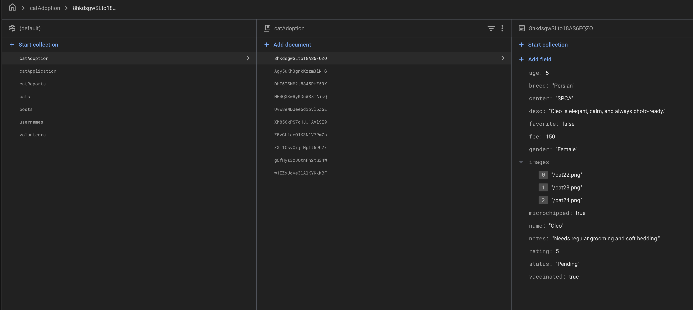  

---

### 5) Testing the Application
For Mobile sizes, we used "iPhone 14 Pro Max" (or any iPhone Pro Max should work)

#### Manual Testing
Perform the following checks before submission:

| Area | Test Description | Expected Outcome |
|:--|:--|:--|
| VolunteerSignupLoginPage - Form Validation | Enter invalid email, leave fields empty, enter mismatched passwords | Error messages display for invalid email format, required fields, and password mismatch |
| VolunteerSignupLoginPage - Registration | Fill all fields correctly and submit registration | User account created successfully, redirected to Report page |
| VolunteerSignupLoginPage - Login | Enter correct credentials and submit | User successfully logs in, redirected to Report page |
| VolunteerSignupLoginPage - Login | Enter incorrect credentials | Error message displays: "Invalid email or password" |
| ReportPage - Form Validation | Submit form with empty required fields | Error messages display for location, status, breed, and description |
| ReportPage - Cat Breed Identification | Upload cat image | AI identifies cat breed and displays result |
| ReportPage - Image Upload | Select an image file | Image preview displays with remove button |
| ReportPage - Image Upload | Click remove button during breed identification | Remove button is disabled while AI is processing |
| ReportPage - Image Upload | Click remove button after breed identified | Image preview and breed results are cleared |
| ReportPage - Map Display | Enter location with nearby cats (< 2km, past 24h, same breed) | Map displays showing user location and nearby matching cats |
| ReportPage - Map Display | Enter location with no nearby matching cats | Map does not display |
| ReportPage - Map Display | Click on cat marker on map | Popup shows cat details (name, location, distance, reported time) |
| ReportPage - Side Drawer | Open side drawer after breed identification | "Nearby Similar Reports" section shows cat report cards for matches |
| ReportPage - Side Drawer | Expand "Other Cat Reports" section | All submitted cat reports display regardless of location or breed |
| ReportPage - Form Submission | Fill all required fields and submit | Cat report saved to database, form resets, success message displays |
| MapPage - Search Location | Enter postal code or location name in search | Map centers on searched location |
| MapPage - Cat Markers | Load map page | Cat markers display on map for all reported cats |
| MapPage - Marker Popup | Click on a cat marker | Popup card displays with cat details (name, photo, last seen, location) |
| MapPage - View Profile | Click "View Full Profile" in popup card | Redirects to full cat profile page (CatProfile.vue) |
| ForumPage - Search Posts | Enter username or post description in search | Posts filtered to match search query |
| ForumPage - Filter Posts | Select "Newest First" or "Oldest First" | Posts reordered by selected filter |
| ForumPage - Create Post | Click create post button, fill form, and submit | New post created and displays in feed |
| ForumPage - Add Comment | Click comment button, enter text, and submit | Comment added to post and displays in comment modal |
| ForumPage - View Author Profile | Click on post author's profile picture or username | Redirects to VolunteerProfileViewPage for that user |
| VolunteerProfileViewPage - User Information | Navigate to volunteer profile view page | Displays user information (name, bio, avatar, skills, region) |
| VolunteerProfilePage - User Information | Navigate to own profile page | Displays current user's information (name, bio, avatar, skills, services) |
| VolunteerProfilePage - Edit Profile | Click "Edit Profile" button | Popup modal displays with editable profile fields |
| VolunteerProfilePage - Edit Profile | Update profile information and save | Profile updates successfully, modal closes |
| VolunteerProfilePage - Logout | Click logout button | User logged out and redirected to landing page |
| DonationPage - Form Validation | Leave amount field empty or enter invalid amount | Error message displays for required/invalid amount | | DonationPage - Stripe Payment | Enter credit card details (4242 4242 4242 4242, 12/34, 567) | Stripe validates card information |
| DonationPage - Donation Success | Complete payment with valid card | Redirects to DonationSuccessPage |
| DonationPage - Invalid Card | Enter invalid card information | Stripe displays error message |
| DonationSuccessPage - Success Message | Complete donation process | Success message displays confirming donation |
| Adoption Page - Search/Sort Cats |Enter cat name or breed in search. Toggle "Sort Status", "Sort Default", "Vaccinated" buttons.| Displayed Cat Profile Changes. Cat Catalogue reordered according to sort feature.|
| Adoption Page - Cycle Carousel | Click displayed image (set of 3) below the cat name and description. | Displayed cat picture will update. |
| Adoption Page - Details Card | Click "Show Details" button. | Cat details card appears with cat information. "Show Details" updates to "Hide Details". |
|Adoption Page - Scroll Catalogue | Put cursor inside the cat catalogue (purple gradient section). Scroll up and down.| Displayed list of cats changes. |
|Adoption Page - Favourite Button|Click the heart button on the cat profile. Repeat for multiple. | Cat Catalogue heart icons updated for favourited cats.|
|Adoption Page - Open Application Form | Click "Indicate Interest" button.|Page scrolls user down to the adoption application section |
|Adoption Page - Form Validation | Click "Submit" button without any input. (Repeat after filling multiple questions)|User will be greeted with "Fill out this field" above the relevant questions. (Questions 1, 5, 7, 9, 10) |


### 6) Common Issues & Fixes

| Issue | Cause | Fix |
|:--|:--|:--|
| `Module not found` | Missing dependencies | Run `npm install` again |
| `Server error when making donation` | Donation feature won't work on localhost, only works the deployed Vercel app | Make the donation on the deployed website instead |


---

## Group Reflection


 - Ashraf: I learnt how to get creative with how we want to design and build the user experience. I also learnt how to set up server hosting via Vercel.

 - Rosh: Learned to use Figma to design UI/UX workflow and fetch/send data between firebase and frontend. Learned the importance of communicating regularly with the team, empathise with the user every step of the development process, and seeking consistent feedback from mentors.

 - Charmaine: After creating the initial wireframe, I learned how to transform it into a fully functional website that is both dynamic and responsive. Throughout the process, I considered the interface from both a user’s and a developer’s perspective to ensure the website is intuitive and easy to navigate. I also became more familiar with using GitHub for version control and learned how to collaborate effectively with my teammates throughout the development process.

 - Rayner: I learnt how to guide people who are new to web development, and adjust tasks appropriate to their current learnings. Learnt to better break down tasks into more followable steps that help facilitate learning.

 - Kevan: I learned more about Git branching and pull requests, integrating Firebase with the frontend, using the Vue framework, and working with geolocation in OpenStreetMap.

 - Jing Xiang: I learnt how to use github collaboratively, branching, pull requests etc. And the general usage of vue.js and firebase

**Team Reflection**
- Working with frameworks such as Vue.js, Firebase, and Vercel gave us hands-on experience in developing a modern web application. We learned how to integrate frontend and backend (firebase) code, from setting up authentication and databases to designing intuitive user experiences. Tools like Figma and Git/GitHub helped us bridge the gap between design and development while improving our workflow and version control practices. We also developed a deeper appreciation for how these frameworks streamline development, allowing us to focus more on solving user needs rather than building everything from vanilla HTML/CSS.

- One of the challenges we faced was figuring out how to design our application to be practical for real-world use. Initially, our ideas seemed great, but they weren’t very feasible in reality. After consulting with our professor, we revamped our user story and application, and it now has a flow that makes much more sense.

- Through this project, we learned that effective communication and collaboration is very important. Regular check-ins and updates helped us stay aligned and support one another’s learning curves. As a team, we grew more adaptable, dividing tasks based on individual strengths while ensuring everyone contributed meaningfully. This project strengthened our ability to tackle project collectively, and managing time effectively.
